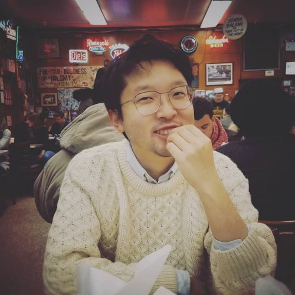

### Education

<ul style="padding-left: 0; list-style-position: inside;">
  <li>MSc Computer Science, University of British Columbia 2016</li>
  <li>B.A.Sc Engineering Science, University of Toronto 2013</li>
</ul>

### Current

I am currently a **Research Engineer** at **Google DeepMind** working on **agentic memory systems**.

I am broadly interested in systems, machine learning, economics and signal processing. I've dabbled a bit in each without being an expert in any.

### Work

* **Large Language Models**: mostly having to do with playing around with architectures and reasoning. I try to publish when I can.
  * [*Gemini 2.5: Pushing the Frontier with Advanced Reasoning, Multimodality, Long Context, and Next Generation Agentic Capabilities*](https://arxiv.org/abs/2507.06261) (Google DeepMind, 2025)
  * [*BIG-Bench Extra Hard*](https://aclanthology.org/2025.acl-long.1285.pdf) (Google DeepMind, 2025)
  * [*Zipper: A Multi-Tower Decoder Architecture for Fusing Modalities*](https://arxiv.org/pdf/2405.18669) (Deepmind, 2024)
  * [*LLMs Cannot Find Reasoning Errors, But Can Correct Them Given the Error Location*](https://aclanthology.org/2024.findings-acl.826.pdf) (DeepMind, 2024)
  * [*AudioPaLM: A Large Language Model That Can Speak and Listen*](https://arxiv.org/pdf/2306.12925) (Google Resarch, 2023)

   You can find my most recent work [on Google Scholar](https://scholar.google.com/citations?user=IQyjO6AAAAAJ&hl=en).

* **Systems**: In a past life, I did systems and computer networks (Arista 2016-2019). At Arista I built software defined network controllers. In grad school for systems, my thesis was this:
  * [*Cross-platform data integrity and confidentiality with graduated access control*](https://open.library.ubc.ca/soa/cIRcle/collections/ubctheses/24/items/1.0340667) (UBC, 2016)

   I still try to keep up-to-date when I can by reading systems papers from conferences like OSDI, SOSP, SIGCOMM, EUROSYS, MOBISYS, and IEEE Wireless Transactions.

* **Physics**: In another life, I once dabbled with physics:
  * [*Photonic crystal fiber for efficient Raman scattering of CdTe quantum dots in aqueous solution*](https://pubs.acs.org/doi/abs/10.1021/nn200157z) (ACS Nano, 2011)

   

* **Signal Processing**: My undergrad thesis:
  * [*Joint Estimation of Phase-Noise, Frequency Offset and Channel Using Variational Inference Methods in MIMO-OFDM*](assets/UndergraduateThesis.pdf) (University of Toronto, 2013)

### Life

When I am not dabbling, you may find me sketching, figuring out how to build my own radar, swing/bachata dancing, skiing, learning French, sailing and travelling. I am also rumoured to write once in a while. Sometimes, I think my current career is just a gig until a sitting Prime Minister realizes my talents as a speech writer.
